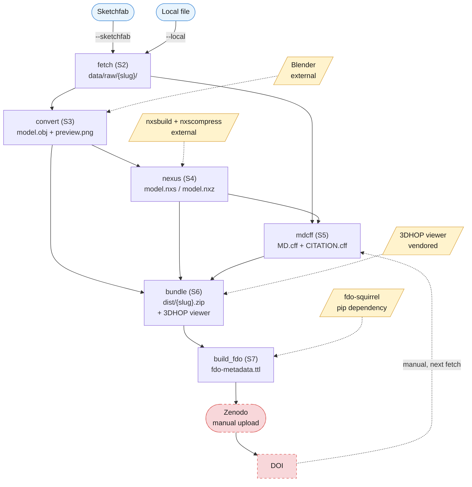

# fdo-3d-packager

Packages a 3D model -- fetched from Sketchfab or supplied as a local file --
into a FAIR Digital Object (`fdo:3DDataFDO`) ready for ingest by
[`fdo-squirrel`](https://github.com/FDOx-squirrel/fdo-squirrel).

## Infrastructure overview

How a Sketchfab model (or a local file) becomes an ingestible FDO --
`fetch` through `build_fdo` are this repo's own steps (`main.py`, one
module each under `py/`); the yellow parallelograms are external
dependencies (Blender, `nxsbuild`/`nxscompress`, the vendored 3DHOP
viewer, `fdo-squirrel` itself); the dashed red loop is the one manual step
(Zenodo) nothing here automates.



Rendered as a standalone image at
[`docs/infrastructure.jpg`](docs/infrastructure.jpg) (for slides, papers,
anywhere Mermaid doesn't render) -- both come from the same source,
[`docs/infrastructure.mmd`](docs/infrastructure.mmd); regenerate the JPG
after editing the source with:

```cmd
python docs\render_infrastructure_diagram.py
```

Needs Node.js (`npm install -g @mermaid-js/mermaid-cli`) and
`pip install Pillow` -- documentation tooling only, neither is in
`requirements.txt` since neither is needed to run the actual pipeline.

## Repository structure

```
fdo-3d-packager/
├── PRIMER.md              German work plan (internal, see primer-repo skill)
├── README.md               this file
├── LICENSE                 MIT
├── CITATION.cff
├── requirements.txt
├── .gitignore
├── main.py                 orchestrator -- the only entry point
├── docs/
│   ├── infrastructure.mmd            Mermaid source, Sketchfab/local -> FDO
│   ├── infrastructure.jpg            rendered standalone image
│   └── render_infrastructure_diagram.py   regenerates the JPG from the .mmd
├── .github/
│   ├── workflows/build.yml           CI: --strict smoke test, PRIMER.md S9
│   └── ci-fixtures/                  fake Blender/nxsbuild/nxscompress + fixture seeder
├── schemas/md_cff/
│   └── MD.cff-schema.yaml   vendored copy of fdo-squirrel's schema (mdcff step, S5)
├── assets/3dhop/            vendored, trimmed 3DHOP miniviewer (bundle step, S6)
│   ├── NOTICE.md             provenance, pin, what was trimmed and why
│   ├── LICENSE.txt           GPLv3 -- ships inside every dist/<slug>.zip too
│   ├── index.html            upstream's 3DHOP_no_tools.html, one line changed
│   └── js/ skins/ stylesheet/
├── py/
│   ├── fdo_3d_packager_utils.py   RELEASE, paths, canonical writers, fingerprints
│   ├── step_fetch.py               S2: --sketchfab/--local -> data/raw/<slug>/
│   ├── step_convert.py             S3: Blender -> dist/<slug>/model.obj + preview.png
│   ├── blender_convert_headless.py S3: runs inside Blender's own Python (bpy), not pip-installed
│   ├── step_nexus.py               S4: nxsbuild/nxscompress -> model.nxs/.nxz
│   ├── step_mdcff.py               S5: MD.cff + CITATION.cff, schema-validated
│   ├── step_bundle.py              S6: dist/<slug>.zip in fdo-squirrel's layout
│   └── step_build_fdo.py           S7: run the bundle through fdo-squirrel
├── data/raw/                inputs (generated by fetch, read-only afterwards)
│                            data/raw/<slug>/<model file> + any sibling files it
│                            references (scene.bin, textures/...), plus per slug
│                            source_info.json (S2/S3/S4/S5 handoff, see
│                            step_fetch.py) and sketchfab_meta.json (audit +
│                            mdcff enrichment source, --sketchfab only)
└── dist/                    products: dist/<slug>/model.obj+textures/+preview.png+
                             model.nxs+model.nxz+MD.cff+CITATION.cff, plus the
                             final dist/<slug>.zip the bundle step (S6) writes,
                             and dist/<slug>_release/ the build_fdo step (S7)
                             writes (gitignored, see PRIMER.md S7)
```

## How to run

Tested with **Python 3.10** on **Windows** (Visual Studio Code).

```cmd
git clone https://github.com/FDOx-squirrel/fdo-3d-packager.git
cd fdo-3d-packager
python -m venv .venv
.venv\Scripts\activate
pip install -r requirements.txt
python main.py --list
python main.py --dry-run
python main.py
```

`python main.py` runs every step except `fetch` (the one step allowed to
touch the network -- see `PRIMER.md` A3). Call it explicitly to pull a
model in:

```cmd
set SKETCHFAB_API_TOKEN=your-token-here
python main.py --only fetch --sketchfab "https://sketchfab.com/3d-models/donaghmore-church-ruin-a602439f3513431ea1b306358a2581e5"
python main.py --only fetch --local .\scans\rathealy_kiriengine.glb --title "Rathealy Standing Stone" --creator "Anne-Karoline" --licence "CC-BY 4.0" --source-note "KiriEngine, 180 photos, 2026-03"
```

`--sketchfab` is repeatable for a batch fetch:

```cmd
python main.py --only fetch --sketchfab "https://sketchfab.com/3d-models/aaa..." --sketchfab "https://sketchfab.com/3d-models/bbb..." --sketchfab "https://sketchfab.com/3d-models/ccc..."
```

Each URL is fetched independently -- one bad URL doesn't abort the rest of
the batch, the run only fails outright if *every* URL failed (a partial
batch prints `Warning: ...` and still exits 0, `--strict` turns that into
a failure like everywhere else in this repo). `--title`/`--creator`/
`--creator-profile`/`--licence`/`--licence-url`/`--source-note` only make
sense for a single model, so passing any of them together with more than
one `--sketchfab` URL is a hard error (checked before any network call).

`--sketchfab` pulls title/description/creator/licence from Sketchfab's Data
API automatically; `--local` has no such source, so without
`--title`/`--creator`/`--licence` the step writes `"TODO: ... not set"`
placeholders into `data/raw/<slug>/source_info.json` and prints a
`Warning: ...` message. Plain `python main.py --only fetch ...` still
succeeds (exit 0) so you can fetch first and fill in metadata by hand
afterwards; add `--strict` once metadata is meant to be final -- it turns
that warning into a failure, which is what CI runs.

Once more than one model has been fetched, later steps need to be told
which one to act on:

```cmd
python main.py --slug govan-2
python main.py --all-slugs
```

`--slug <name>` runs the default pipeline (or whatever `--only`/`--from`/
`--skip` selects) for exactly that model; with only one model ever
fetched, `--slug` is optional (auto-detected). `--all-slugs` loops the
selection over every fetched model in turn, printing a `=== slug: ... ===`
banner between them; it can't be combined with `--slug`. With more than
one slug in play, a failure on one no longer aborts the rest -- each slug
is independent, and the run only fails outright if *every* slug failed
(a partial run prints `Warning: N/M slug(s) failed: ...` and still exits
0, `--strict` turns that into a failure). With a single slug, a failure
still stops the run immediately, same as before -- there's nothing to
skip ahead to.

`fetch` can be part of the same `main.py` call instead of a separate one:

```cmd
python main.py --from fetch --sketchfab "https://sketchfab.com/3d-models/aaa..." --sketchfab "https://sketchfab.com/3d-models/bbb..." --nxsbuild-bin "C:\nexus\nxsbuild.exe" --publisher-label "Research Squirrel Engineers Network"
```

A real run of this looks like the following -- both models fetched,
converted, packaged and run through `fdo-squirrel` in one call
(confirmed end to end, PRIMER.md S7 Nachtrag 2026-09-07 (2)):

```cmd
python main.py --from fetch --sketchfab "https://sketchfab.com/3d-models/govan-2-b9dc56bfc1d342f6b4da3281e6629c07" --sketchfab "https://sketchfab.com/3d-models/freshford-st-lachtains-well-low-poly-ae1e1f4daa7d433dbbf076407134e81e" --nxsbuild-bin "C:\Nexus_43\nxsbuild.exe" --nxscompress-bin "C:\Nexus_43\nxscompress.exe" --publisher-label "Research Squirrel Engineers Network" --publisher-id "http://www.wikidata.org/entity/Q73901970"
```

`fetch` always runs exactly once (never per-slug -- the slugs don't exist
before it runs), then the rest of the selection runs automatically for
exactly the model(s) it just fetched, not every model ever fetched.
`--slug`/`--all-slugs` aren't needed here (and are ignored, with a note,
if passed) -- `fetch` already knows precisely which slug(s) matter more
reliably than either flag could.

Once `fetch` has run, `convert` picks up `data/raw/<slug>/source_info.json`
automatically:

```cmd
python main.py --only convert
python main.py --only convert --blender-bin "C:\Program Files\Blender Foundation\Blender 4.2\blender.exe"
```

`--blender-bin` defaults to `blender` on PATH, overridable via the
`BLENDER_BIN` environment variable too.

Once `convert` has run, `nexus` picks up `dist/<slug>/model.obj` automatically:

```cmd
python main.py --only nexus
python main.py --only nexus --nxsbuild-bin "C:\nexus\nxsbuild.exe" --nxscompress-bin "C:\nexus\nxscompress.exe"
python main.py --only nexus --nxsbuild-ram 8000
```

`--nxsbuild-bin`/`--nxscompress-bin` default to `nxsbuild`/`nxscompress` on
PATH, overridable via the `NXSBUILD_BIN`/`NXSCOMPRESS_BIN` environment
variables too. `--nxsbuild-ram <MB>` (`-r`, RAM budget, nxsbuild's own
default is 2000) is passed straight through to `nxsbuild` -- useful on
large models. `--nxsbuild-original-textures` (`-O`, skip texture-atlas
repacking) also exists but is **not recommended**: confirmed against a
real run (Govan 2, 2026-09-04) to produce a texture-less `.nxz`
(`nxscompress` reports `Textures: 0`, `nxsview` shows no texture with
Colors either on or off) -- since `bundle` (S6) needs a self-contained
`.nxz` for the 3DHOP viewer, this isn't usable here despite being faster.
Kept as an opt-in flag, not a default.

Once `nexus` has run, `mdcff` picks up `data/raw/<slug>/source_info.json` and
`dist/<slug>/model.nx*` automatically -- it just needs a publisher, which
has no default (there is no sensible one to guess):

```cmd
python main.py --only mdcff --publisher-label "Research Squirrel Engineers Network" --publisher-id "http://www.wikidata.org/entity/Q73901970"
```

`--publisher-label` is required; `--publisher-id` (e.g. a Wikidata/ROR IRI --
the Research Squirrel Engineers Network's own Wikidata entity,
[Q73901970](https://www.wikidata.org/wiki/Q73901970), above) is optional. Both fall back to the `FDO_PUBLISHER_LABEL`/
`FDO_PUBLISHER_ID` environment variables (same pattern as `--blender-bin`/
`BLENDER_BIN`), so you don't have to retype them on every run -- there is
still no hardcoded default (see `PRIMER.md` A4 for why: almost every model
packaged here belongs to an external creator or is private work, so
"Research Squirrel Engineers Network" is the realistic answer, essentially
never LEIZA). Missing `dist/<slug>/model.obj`/`model.nxs`/`model.nxz` (i.e.
`convert`/`nexus` haven't run yet) or a missing publisher (neither flag nor
env var) both fail the step outright. `MD.cff`'s `id` field is always a
fixed `"TODO: ..."` placeholder -- this repo never assigns a PID, see
`PRIMER.md` A4 -- fill in the real DOI by hand after a Zenodo upload. If
`source_info.json` still has unresolved `title`/`creator`/`licence`
placeholders from `fetch`, `mdcff` still writes the files but prints a
`Warning: ...` (exit 0); add `--strict` to fail on that instead.
`description` is auto-generated from title/creator when `fetch` didn't
supply one (this happens for every `--local` run, since it has no
`--description` flag).

For `--sketchfab` runs, `mdcff` also reads back `data/raw/<slug>/sketchfab_meta.json`
(the full API response `fetch` already saved) to enrich the output beyond
what `source_info.json` carries: Sketchfab tags/categories become extra
`keywords`, `publishedAt`/`createdAt` become `date_released`/`date_created`,
and face/vertex counts become a short `technique.processing` note. None of
this is required -- `--local` runs (no `sketchfab_meta.json`) still work,
just without the enrichment; `--source-note` (`--local`'s free-text
acquisition note) always lands in `technique.acquisition.method`
regardless of input mode.

CITATION.cff's `license` field (SPDX only, unlike MD.cff's free-text
`license.label`) is derived from `licence_url` when it's a recognisable
Creative Commons URL (`.../licenses/by/4.0/` -> `CC-BY-4.0`,
`.../publicdomain/zero/1.0/` -> `CC0-1.0`) -- this works for both
`--sketchfab` and `--local` (a plain SPDX-looking `--licence` value is
still used as a last-resort fallback). Earlier versions of this step
guessed from Sketchfab's `license.slug` directly and got the slug format
wrong (`"cc-by"` instead of the real `"by"`) -- corrected 2026-09-07 (5)
against real API data.

Once `mdcff` has run, `bundle` picks up `dist/<slug>/` automatically and
needs no flags of its own:

```cmd
python main.py --only bundle
```

It packages `MD.cff`, `CITATION.cff`, the model files (`.obj`/`.mtl`/
`.nxs`/`.nxz`), any textures, `preview.png` and a vendored
[3DHOP](https://3dhop.net) miniviewer into `dist/<slug>.zip`, in the
layout `fdo-squirrel` expects (`data/model/`, `data/textures/`,
`data/images/`, `viewer/` -- see `PRIMER.md` S6 for the exact rules). An
untextured model is not an error: `data/textures/` is simply left out of
the ZIP when `dist/<slug>/textures/` doesn't exist. Two runs over
unchanged inputs produce a byte-identical `dist/<slug>.zip`. Missing
`convert`/`nexus`/`mdcff` output fails the step outright with a clear
message naming what's missing.

Once `bundle` has run, `build_fdo` picks up `dist/<slug>.zip` automatically
and needs no flags of its own:

```cmd
python main.py --only build_fdo
```

It runs the ZIP through a real `fdo-squirrel` instance (`pip install -r
requirements.txt` already installed it, see External requirements below)
and writes the result to `dist/<slug>_release/` -- `fdo-metadata.ttl`, the
HTML/JSON modelling reports, a Mermaid diagram, and `fdo-squirrel`'s own
re-zipped "finished FDO bundle" ready to publish by hand. This directory is
gitignored (`dist/*_release/`): it's a rebuildable byproduct of the
already-committed `dist/<slug>.zip`, not a second citable version. Nothing
here talks to Zenodo -- that upload, and copying the resulting DOI into
`MD.cff`'s `id` field, stays manual (`PRIMER.md` A4). Missing
`dist/<slug>.zip` (i.e. `bundle` hasn't run) or a missing `fdo-squirrel`
install both fail the step outright with a clear message.

## External requirements (not pip-installable)

- **Blender**, headless-capable, for the `convert` step.
- **`nxsbuild` / `nxscompress`** from
  [`cnr-isti-vclab/nexus`](https://github.com/cnr-isti-vclab/nexus), for the
  `nexus` step.

`fdo-squirrel` itself is **not** listed here despite the `build_fdo` step
(S7) needing it -- unlike Blender/nxsbuild, it is a pip dependency
(`requirements.txt`, pinned commit), installed by the same
`pip install -r requirements.txt` as everything else; `build_fdo` finds it
as the console script `pip` puts next to this interpreter, see
`py/step_build_fdo.py`.

The `bundle` step (S6) needs none of the above -- the
[3DHOP](https://3dhop.net) viewer it packages is vendored under
`assets/3dhop/` (trimmed copy of upstream's `minimal/` package, pinned to
tag `4.3`, see `assets/3dhop/NOTICE.md`), not fetched at build time.
**Note the licence:** 3DHOP is GPLv3 (`assets/3dhop/LICENSE.txt`), which
ships inside every `dist/<slug>.zip` this repo produces
(`viewer/LICENSE.txt`) -- this repo's own code stays MIT, but each
packaged data bundle carries a small amount of GPLv3-licensed viewer code
alongside it.

## AI usage

Parts of the Python code in this repository were written with the
assistance of Claude (Anthropic). All AI-assisted code was reviewed and is
supervised by Florian Thiery (Research Squirrel Engineers).

## Authors and licence

(c) 2026 Florian Thiery (Research Squirrel Engineers). Released under the
MIT Licence -- see [`LICENSE`](LICENSE).

## Citation

If you use this software, please cite it using the metadata in
[`CITATION.cff`](CITATION.cff).
